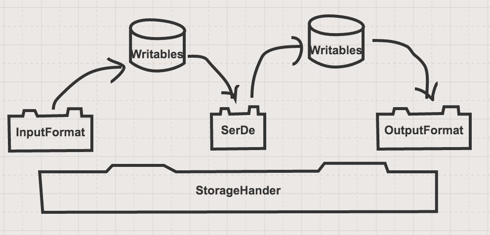

# Hive On Kudu Design Document
## Design Goals
The primary goal of developing Hive on Kudu is to fully leverage Hive and Kudu's capabilities. The goal is to release the first version of Hive on Kudu with the following features. 

1. Support for Hive External tables to Kudu
    * SerDe to auto-create columns in Hive
2. Support for Hive managed tables on Kudu
3. Support basic and advanced partitioning capabilities of Kudu
4. Support for Hive transactions (Updates and Deletes)
5. Support for predicates push-down

## Design
Hive provides a Storage Handler to integrated other storage systems with Hive. Primary example of a Storage System that leverages storage handler is HBase. Below are some useful links to familiarize with Storage Handlers in Hive with examples.
* [Hive Storage Handler guide](https://cwiki.apache.org/confluence/display/Hive/StorageHandlers)
* [Hive-HBase Storage Handler](https://github.com/BimalTandel/hive/tree/master/hbase-handler)
* [Hive-JDBC Storage Handler](https://github.com/qubole/Hive-JDBC-Storage-Handler)
* [ElasticSearch Storage Handler](https://github.com/elastic/elasticsearch-hadoop/tree/master/hive/src/main/java/org/elasticsearch/hadoop/hive)

In addition to a Storage Handler Hive provides capability to provide specific Input and Output format to handle reads and writes, and a SerDe to serialize and deserialize data to and from the Output and Input formats. 

High Level interactions and relationships before the components:

 "Custom Storage Handler Components")

To complete integration of Hive and Kudu these components will have to be developed.
* HiveKudu Storage Handler
* HiveKudu Input Format (With ACID support for Updates and Deletes)
* HiveKudu Output Format (With ACID support for Updates and Deletes)
* HiveKudu SerDe
* HiveKudu Writable 

> Hive Interfaces and Classes are all based on MR1 APIs. I found it challenging to extend the KuduTableInputFormat and KuduTableOutputFormat as they are based on MR2 APIs. The only way to successfully use them would be to convert and publish a version with MR1 APIs. 

## Detailed Design (Work in Progress)
### HiveKudu Storage Handler
Things that need further discussion
* How should we map Hive DDLs for providing partitioning options for Kudu Tables?
    * Option 1: Use Hives "Clustered By" and "INTO numbuckets BUCKETS" clauses.
    * Option 2: Use TBLPROPERTIES Key Value Pairs
* How should we decompose predicates to allow Kudu to filter records during table scans? We can attempt to do what is currently supported via Impala. 

### HiveKudu Serde and HiveKudu Writable
* Review the current design of the Writable object
* Hive to Kudu datatype mappings. (Kudu treats timestamps as LONG).

### HiveKudu Input & Output format
* Can we leverage the ACIDInputOutput format for Kudu?
* How to leverage hive transactions for Kudu?
